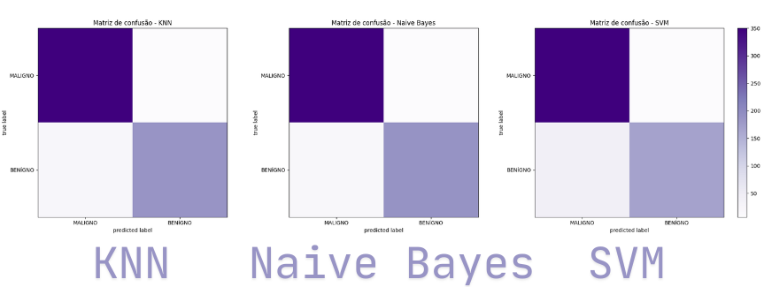

# Projeto de Classificação de Câncer

Projeto de classificação de tumores de câncer de mama utilizando 3 classificadores: SSVM, KNN e Naive Bayes, para prever entre maligno ou benigno.

## Como Executar

Para executar o arquivo, basta usar o Python 3 com o seguinte comando:
`python3 classifiers_breast_cancer.py`

Caso não queira gerar as imagens de matriz de confusão, comentar linhas que chamam a função `demo_confiMatrix`

## Escolha o Classificador

Na função `main`, escolher qual(is) classificador executar. Há os seguintes classificadores:

- SVM (Support Vector Machine)
- KNN (K-Nearest Neighbors)
- NB (Naive Bayes)

Para escolher qual classificador executar, basta chamar a função correspondente na função `main`.

Naive Bayes se adequou melhor aos dados, ao considerar as métricas,
com média na precision macro de 0.94, um recall médio de 0.92, F1 médio de 0.93 e Acurácia
média de de 0.93, além de considerar todas as saídas da confusion matrix, que mostra que o
classificador Naive Bayes obteve melhor desempenho, mostrando menos falso-positivos e
falso-negativos, e melhores resultados em verdadeiro-positivos e verdadeiro-negativos.
